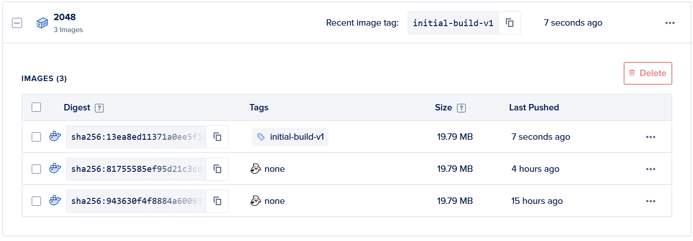
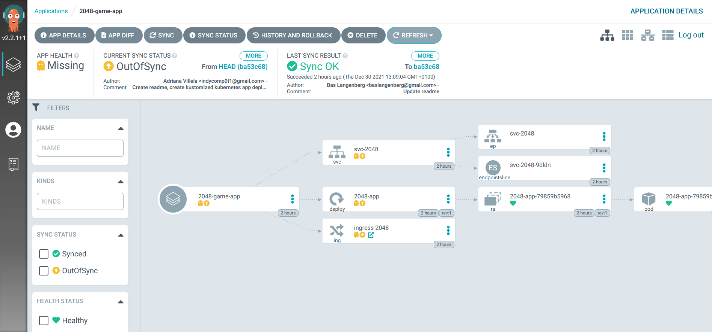
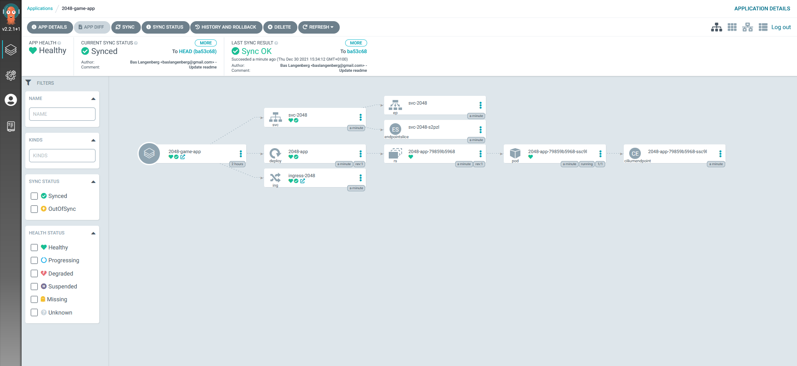

+++
title = "GitOps on DigitalOcean Kubernetes services, a case study"
date = 2021-12-30T00:13:00+00:00
tags = []
categories = []
+++

I thought it would be fun to challenge myself during the Christmas period. I'm fascinated by GitOps, and from practical experience, deploying an application composed of multiple microservices can grow quite tedious when their numbers grow. Dependencies between different services can also cause pain from a deployment stand of view. I'd like to solve this problem in a proof of concept.

DigitalOcean was so nice to run [a challenge](https://www.digitalocean.com/community/pages/kubernetes-challenge) for the community. Giving me a bunch of credit to play with so I can proof of concept my hearth out within it costing me anything.

## Goals set

I'd like to tackle the following challenges:

1. Spin up infrastructure using Terraform
  a. Kubernetes Clusters
  b. DigitalOcean Load Balancers
  c. Initial deployment of ArgoCD
  d. Container registry
2. Setup Tekton for continuous integration
3. Build & push sample application components to container registry with Tekton
4. Automatically deploy to the development cluster
5. Only deploy to the production cluster after a manual sync

Due to time constraints in the christmas break and as I want to spend some time with the family as well, I started out with a much smaller scope. I still want to implement all the functionality I initially outlined, so more blogposts can be expected.

All technical details are coded up as Infrastructure As Code in the [Github repository](https://github.com/BasLangenberg/gitops-usecases) accompanying this blog post. In this blog post, I will mostly describe my lessons learned.

## 1. Terraform for Kubernetes resources can be quite tedious

I use Terraform on a daily basis at work, but using it combined with Kubernetes is a bit annoying.

For starters, you cannot create the Kubernetes cluster and try to manipulate it with the Terraform Kubernetes Provider in the same run. Terraform will be unable to validate the objects you defined as the cluster is not there yet. Splitting up the logic into multiple modules did not work. I had to write two separate root modules, add a data call to the DigitalOcean API to query the cluster properties to setup the provider and continue from there. To make this easier, I wrote up a make file to quickly provision and destroy the required infrastructure for this project.

I wanted to create all required infrastructure in one command. ```make``` in this case. However, deploying off the shelve Kubernetes tooling with Terraform became more tedious when I ran into ingress-nginx. Let me elaborate on this a bit more.

I use an awesome tool called [tfk8s](https://github.com/jrhouston/tfk8s) to convert the enormous argocd and ingress-nginx yaml configurations to actual Terraform code. When re-applying the manifests during my iterative development, I ran in a lot of Terraform errors.

```bash
│ Error: Provider produced inconsistent result after apply
│
│ When applying changes to kubernetes_manifest.job_ingress_nginx_ingress_nginx_admission_create, provider
│ "provider[\"registry.terraform.io/hashicorp/kubernetes\"].mgmt" produced an unexpected new value: .object.spec.template.metadata.labels: new element
│ "controller-uid" has appeared.
│
│ This is a bug in the provider, which should be reported in the provider's own issue tracker.
╵
```

I get why this works, but I think the provider should not care about fields set we did not specify in our initial deployment, just as is the case with other Terraform providers. I get that the actual schema changed, but tools setting annotations on Kubernetes objects is going on all the time. I think this needs to mature a bit more.

I decided to rip out the Kubernetes part from Terraform  for the ingress-nginx and argocd installation, and fall back to good old reliable kubectl. I made a minor change to the standard DigitalOcean deployment manifest for ingress-nginx to make it use the load balancer I preprovisioned. I used Kustomize for that.

For secrets and other smaller Kubernetes objects not related to customresourcedefinitions, I decided to move Terraform again, as I can easily query for DigitalOcean values using data providers.

## 2. Tekton is awsome, but it takes some effort to get it to click

[Tekton](https://tekton.dev) is a Kubernetes native way to define tasks, combine them into pipelines and then run pipelines with pipelineruns. All of these concepts are object types in Kubernetes. You can start out by finding the tasks you need to achieve your goal. I started out playing with a Golang app, but since everything took way to long, I moved back to an easier app which needed less tasks. I'll get that built eventually!

Tekton also provides a nice [Hub](https://hub.tekton.dev/), which can be used to find tasks built by the community which you can combine in a pipeline to achieve your goals with Tekton. I've used a few

- The [git-clone](https://hub.tekton.dev/tekton/task/git-clone) task, used to clone my application repository from Github
- The [Kaniko](https://hub.tekton.dev/tekton/task/kaniko) task, used to built a Docker image IN Kubernetes. (More about this later)

Tekton uses Workspaces which are passed between tasks, so every container has access to the same state.

## 3. Project Kaniko is dope

[Kaniko](https://github.com/GoogleContainerTools/kaniko) is easy to explain. It is software which you can use to built a container INSIDE a Kubernetes cluster. Most environments I see are using some kind of build server with Docker and a bunch of other dependencies installed. These are annoying to maintain, mostly when dependencies crash. Kaniko ensures a reproducable building environment, the same promise docker has.

I'm wondering how you can keep your builds fast. If you need to download 3gb of dependencies everytime you build your application, your dependencies get slow. Perhaps some kind of intermediate container, or a volume with cached dependencies can solve this issue. As you probably got from this last paragraph, I did not look into this yet. ;-)

## 4. DigitalOcean Container Registries can generate read-only & read-write tokens for access control

This took way to long to figure out.

I had issues with my Kaniko task building, as it could not push to the DigitalOcean container registry I provisioned. I used Terraform to generate a token and store it in Kubernetes as a dockerconfigjson secret. When you do not explicitly ask for a read-write token, you get a read-only one. This took me longer to figure out than I dare to admit!

So make sur you do it like this!

```terraform
resource "digitalocean_container_registry_docker_credentials" "bl-k8s" {
  registry_name = "bl-k8s"
  write = true
}
```

## 4. Argocd is awesome

I've used Flux before, but [argocd](https://argo-cd.readthedocs.io) is the next level for me. It can act as a central provider to manage multiple Kubernetes clusters and I only touched the surface, so I'll be exploring this a bunch more in the near future.

## How to try this yourself

Follow the steps below to play along with my learnings, hopefully without the frustrating parts where stuff did not work correctly.

All steps are done on Windows 10, using Ubuntu 20.04 in Windows Subsystem for Linux.

### Fork & clone repositories

```bash
mkdir gitops && cd gitops
git clone https://github.com/BasLangenberg/gitops-usecases
git clone https://github.com/BasLangenberg/tekton-pipeline-example-app
```

### Install dependencies

It's in the [README](https://github.com/BasLangenberg/gitops-usecases/blob/main/README.md), just follow the links and the instructions found there.

The most important part is the domain you need. You can use one you already own, or register one, which can be done everywhere on the internet. I use [TransIp](https://www.transip.nl/). Make sure to [configure the domain](https://www.digitalocean.com/community/tutorials/how-to-point-to-digitalocean-nameservers-from-common-domain-registrars) for usage with DigitalOcean.

### Change some code

I've hardcoded the domain everywhere. I might update this in the future, but until that time, some code changes need to be done.

In the gitops-usecases repository:

1. ./kubernetes/argocd/namespace.yaml - Update the host to use your domain
1. ./terraform/infrastructure/main.tf - Update the domain directive to use your domain, already setup in DigitalOcean

In the tekton-pipeline-example-app repository:

1. ./kustomize/ingress.yml - update the host directive

You can of course also add the domain setup logic with Terraform. I leave this as an excercise for the reader.

### Provision infrastructure

Make sure you have generated a read-write API token for DigitalOcean.

```bash
export DIGITALOCEAN_TOKEN=YOURTOKEN
make
```

Get some coffee. This will take about 15 minutes to setup.

### Build and deploy the sample app using cloudnative CI & GitOps

All boilerplate done, it's time to do some cloudnative CI/CD! For ease of use, I've hidden all logic behind Makefile targets. Feel free to inspect the Makefile, it's not doing a lot of complex things.

The command below will trigger a Tekton PipelineRun

```shell
make build
```

Which does a create of the pipelinerun.yaml in the Tekton folder of the gitops-usecase repo.

This will start up some things in the cluster.

```shell
❯ make build
kubectl create -f tekton/pipelinerun.yaml
pipelinerun.tekton.dev/fakeservice-pipelinerun-bm2vj created
```

A pipeline is ran in the cluster...

```shell
❯ kubectl get pipelineruns.tekton.dev
NAME                            SUCCEEDED   REASON    STARTTIME   COMPLETIONTIME
fakeservice-pipelinerun-bm2vj   Unknown     Running   32s
```

which is nothing more than one pod per tasks set in the pipeline

```shell
❯ k get po
NAME                                                     READY   STATUS      RESTARTS   AGE
affinity-assistant-e7b9c7aa66-0                          1/1     Running     0          78s
fakeservice-pipelinerun-bm2vj-build-and-push-image-pod   1/1     Running     0          12s
fakeservice-pipelinerun-bm2vj-clone-repo-pod             0/1     Completed   0          78s
```

After a while, the pipeline is done.

```shell
❯ kubectl get pipelineruns.tekton.dev
NAME                            SUCCEEDED   REASON      STARTTIME   COMPLETIONTIME
fakeservice-pipelinerun-bm2vj   True        Succeeded   2m38s       66s

❯ k get po
NAME                                                     READY   STATUS      RESTARTS   AGE
fakeservice-pipelinerun-bm2vj-build-and-push-image-pod   0/1     Completed   0          103s
fakeservice-pipelinerun-bm2vj-clone-repo-pod             0/1     Completed   0          2m49s
```

The jobs will remain in status complete until the pipelines are cleaned up. That cleanup step will also remove the jobs scheduled on the cluster. I had a LOT of them, as nothing works correctly the first time. (Or the thirtieth time)

Anyway, we now have a fancy new docker image in our container registry!



Now we got the image built, let's use ArgoCD and deploy this image

Get the Argo admin password. You should change this, but I'm not bothered at time of writing

```shell
❯ make argo-pass
kubectl -n argocd get secrets argocd-initial-admin-secret -o jsonpath={.data.password} | base64 -d
SomeValue%
```

Not sure why the % at the end is printed. Has something to do with base64 decoding. So ignore that character.

Now we can login to ArgoCD

```shell
❯ argocd login argo.homecooked.nl
WARNING: server certificate had error: x509: certificate is valid for localhost, argocd-server, argocd-server.argocd, argocd-server.argocd.svc, argocd-server.argocd.svc.cluster.local, not argo.homecooked.nl. Proceed insecurely (y/n)? y
Username: admin
Password:
'admin:login' logged in successfully
Context 'argo.homecooked.nl' updated
```

Create the application
```shell
❯ make argo-demo-app
argocd app create 2048-game-app --repo https://github.com/BasLangenberg/tekton-pipeline-example-app --path kustomize --dest-server https://kubernetes.default.svc --dest-namespace default --sync-option CreateNamespace=false
application '2048-game-app' created
```

In the UI, the application will show as OutOfSync.



Click sync, I did not automate this yet. ;-)



You should be able to play a game now!


```shell
❯ kubectl get pods
NAME                                                     READY   STATUS      RESTARTS   AGE
2048-app-79859b5968-ssc9l                                1/1     Running     0          4m35s
```

## Next steps

I did not make all the goals I've set for this at this time. I always make my proof of concepts too big, and underestimate how long it takes to build stuff I do outside of work. I am also very ambitious, and I want to achieve all of the goals by simply typing ```make``` in my terminal. By reducing the scope, I came very close to this, so I'd like to focus on what I did built and learn, and not on what didn't make the cut.

I'm going to add the next 'features' in the near future.

- Build my much more complex Golang sample app with Tekton.
  - much more complex is an overstatement, I just need a Golang build step.
- Deploy a microservice topology using ArgoCD
  - Make sure dependencies are deployed and running first, before moving on to other services
- Use [Tekton Triggers](https://github.com/tektoncd/triggers) to built and deploy on a git push
- Add a Kubernetes development and production cluster
  - Use Argo to manage those clusters. No manual Create/Delete/Updates allowed!
- Add a UI for Tekton

Expect more blogposts.
